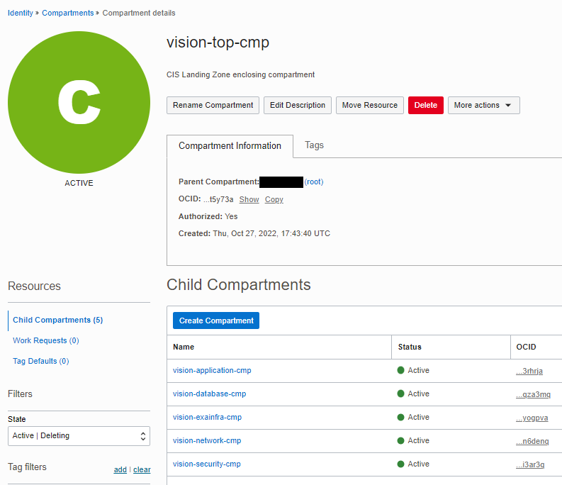

# CIS OCI IAM Compartments Module Usage Example - CIS Landing Zone Quick Start

This example shows how to deploy [CIS Landing Zone Quick Start](https://github.com/oracle-quickstart/oci-cis-landingzone-quickstart) IAM compartments in Oracle Cloud Infrastructure.

It creates the compartment topology as shown in the picture below:


The same structure is shown as it appears in OCI Console:



## Using this example
1. See [input.auto.tfvars.template](./input.auto.tfvars.template) for providing tenancy connectivity information and setting the module input variable. 

**Caution**: The input variabler is a single map of objects named *compartments*. Within the map, each object (compartment) is identified by a key (in uppercase), like *TOP-CMP*, *NETWORK-CMP*, *SECURITY-CMP*, etc. These can actually be any strings, but once defined they MUST NOT be changed, or Terraform will try to recreate the compartments upon *terraform apply*. 

You must provide a valid OCID to *parent_id* attribute in *TOP-CMP* object. It tells the module the existing compartment where *TOP-CMP* compartment gets attached to.

Notice the *freeform_tags* applied to each compartment. They are not required, but if defined they are leveraged by [OCI CIS Landing Zone IAM Policies Module](../../../policies/) for deploying template (pre-configured) policies.

2. In this folder, run the typical Terraform workflow:
```
terraform init
terraform plan -out plan.out
terraform apply plan.out
```