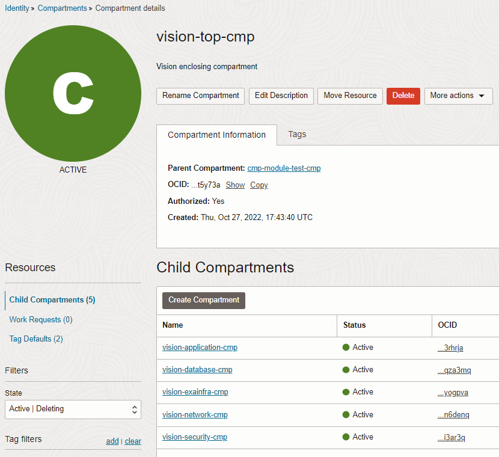

# CIS OCI IAM Compartments Module Example - Vision compartments

This example shows how to deploy Identity and Access Management (IAM) compartments in Oracle Cloud Infrastructure (OCI) for a hypothetical Vision entity. The sample topology is the same one deployed by [CIS Landing Zone Quick Start](https://github.com/oracle-quickstart/oci-cis-landingzone-quickstart). 

It creates the compartment topology as shown in the picture below:


The same structure as shown by OCI Console:



## Using this example
1. Rename *input.auto.tfvars.template* to *\<project-name\>.auto.tfvars*, where *\<project-name\>* is any name of your choice.

2. Within *\<project-name\>.auto.tfvars*, provide tenancy connectivity information and adjust the *compartments_configuration* input variable, by making the appropriate substitutions:
   - Replace *\<REPLACE-BY-THE-PARENT-COMPARTMENT-OCID\>* placeholder by a compartment OCID. This determines the compartment that *TOP-CMP* compartment gets attached to.
   - Replace *\<REPLACE-BY-THE-COST-CENTER-TAG-OCID\>* placeholder in *TOP-CMP* with the actual cost center tag ocid.
   - Replace *\<REPLACE-BY-THE-ENVIRONMENT-TAG-OCID\>* placeholder in *TOP-CMP* with the actual environment tag ocid.
   - Note that tag defaults are optional and you can simply remove *TOP-CMP*'s *tag_defaults* attribute altogether.

Refer to [compartment's module README.md](../../README.md) for overall attributes usage.

Note the *freeform_tags* applied to each compartment. **They are not required**, but if defined they are leveraged by [OCI CIS Landing Zone IAM Policies Module](../../../policies/) for deploying template (pre-configured) policies.

*TOP-CMP* defines two tag defaults. *COST-CENTER-TAG-DEFAULT* will automatically apply value "a1" to any resources created in *TOP-CMP* compartment and  sub-compartments. *ENVIRONMENT-TAG-DEFAULT* will automatically require that users provide a value when creating resources in *TOP-CMP* compartment and  sub-compartments.

3. In this folder, run the typical Terraform workflow:
```
terraform init
terraform plan -out plan.out
terraform apply plan.out
```