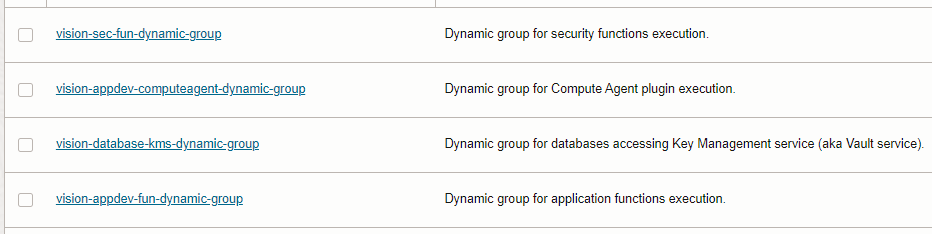
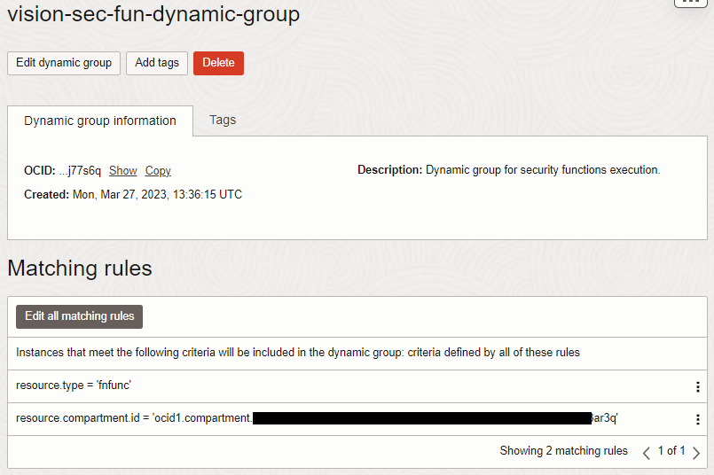

# OCI Landing Zones Dynamic Groups Module Example - Vision Dynamic Groups

## Introduction

This example shows how to deploy Identity and Access Management (IAM) dynamic groups in Oracle Cloud Infrastructure (OCI) for a hypothetical Vision entity. The dynamic groups are the same deployed by [OCI Base Landing Zone](https://github.com/oracle-oci-landing-zones/oci-base-landing-zone).

It creates the following dynamic groups as shown in the picture below:



Looking into one of them:



## Using this example
1. Rename *input.auto.tfvars.template* to *\<project-name\>.auto.tfvars*, where *\<project-name\>* is any name of your choice.

**NOTE**: Each object in the *dynamic_groups* map is indexed by an uppercase string, like *SEC-FUN-DYN-GROUP*, *APPDEV-FUN-DYN-GROUP*, etc. These strings are used by Terraform as keys to the actual managed resources. They can actually be any random strings, but once defined they **must not be changed**, or Terraform will try to destroy and recreate the dynamic groups.

1. Within *\<project-name\>.auto.tfvars*, provide tenancy connectivity information and adjust the *dynamic_groups_configuration* input variable, by making the appropriate substitutions:
   - Replace *\<REPLACE-BY-\*-COMPARTMENT-OCID\>* placeholders by appropriate compartment OCIDs.

2. In this folder, run the typical Terraform workflow:
```
terraform init
terraform plan -out plan.out
terraform apply plan.out
```