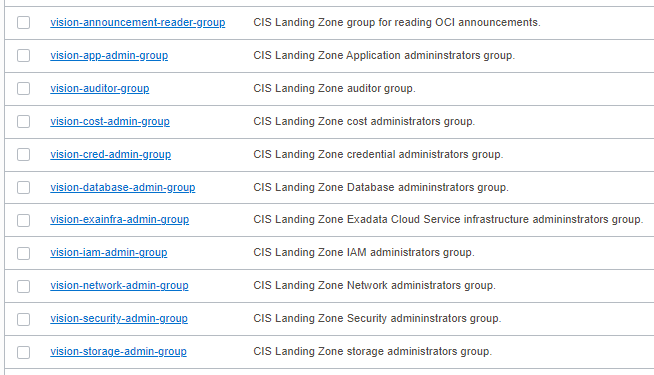

# OCI Groups Module Usage Example - CIS Landing Zone Quick Start

## Introduction

This example shows how to deploy [CIS Landing Zone Quick Start](https://github.com/oracle-quickstart/oci-cis-landingzone-quickstart) groups in Oracle Cloud Infrastructure.

It creates the following groups as shown in the picture below:



## Using this example
1. See [input.auto.tfvars.template](./input.auto.tfvars.template) for providing tenancy connectivity information and setting the module input variable. 

2. In this folder, run the typical Terraform workflow:
```
terraform init
terraform plan -out plan.out
terraform apply plan.out
```