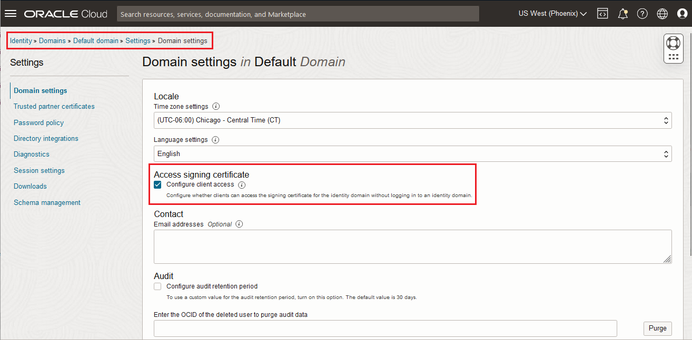
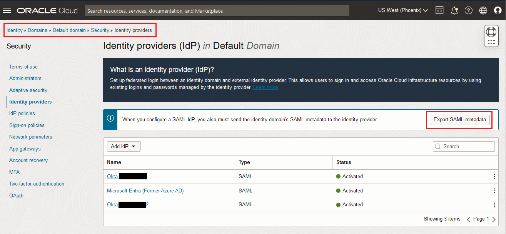
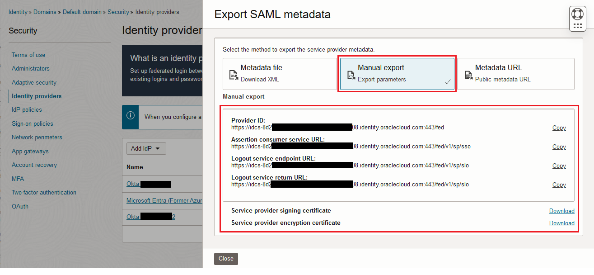
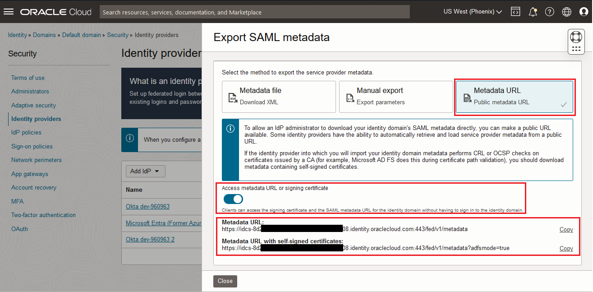
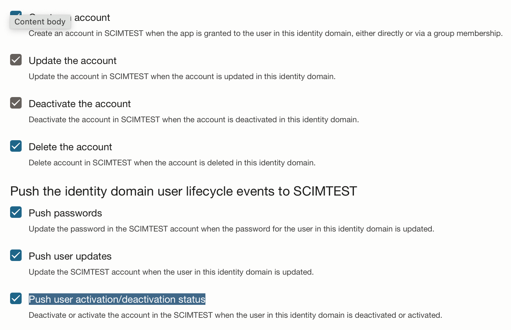
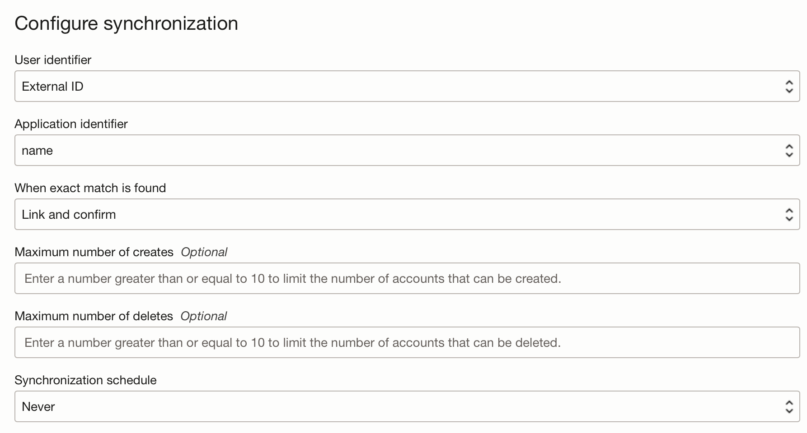

# OCI Landing Zones Identity Domains Module


This module manages Identity and Access Management (IAM) Identity Domains, Identity Domain Groups, Identity Domain Dynamic Groups, and SAML Identity Providers in Oracle Cloud Infrastructure (OCI) based on maps of objects. Identity Domains are a fundamental construct in OCI IAM, they represent a user a group population and its associated configurations and security settings (such as Federation, MFA).

Check [module specification](./SPEC.md) for a full description of module requirements, supported variables, managed resources and outputs.

Check the [examples](./examples/) folder for actual module usage.

- [Requirements](#requirements)
- [How to Invoke the Module](#invoke)
- [Module Functioning](#functioning)
- [Related Documentation](#related)
- [Known Issues](#issues)

## <a name="requirements">Requirements</a>
### Terraform Version >= 1.3.0

This module requires Terraform binary version 1.3.0 or greater, as it relies on Optional Object Type Attributes feature. The feature shortens the amount of input values in complex object types, by having Terraform automatically inserting a default value for any missing optional attributes.

### IAM Permissions

This module requires the following OCI IAM permission:

```
Allow group <group> to manage domains in tenancy
```

## <a name="invoke">How to Invoke the Module</a>

Terraform modules can be invoked locally or remotely.

For invoking the module locally, just set the module *source* attribute to the module file path (relative path works). The following example assumes the module is two folders up in the file system.

```

module "identity_domains" {
  source       = "../../"
  tenancy_ocid = var.tenancy_ocid
  identity_domains_configuration                   = var.identity_domains_configuration
  identity_domain_groups_configuration             = var.identity_domain_groups_configuration
  identity_domain_dynamic_groups_configuration     = var.identity_domain_dynamic_groups_configuration
  identity_domain_identity_providers_configuration = var.identity_domain_identity_providers_configuration
  identity_domain_applications_configuration       = var.identity_domain_applications_configuration
}
```

For invoking the module remotely, set the module *source* attribute to the groups module folder in this repository, as shown:

```
module "identity_domains" {
  source = "github.com/oracle-quickstart/terraform-oci-cis-landing-zone-iam/identity-domains"
  tenancy_id                                       = var.tenancy_id
  identity_domains_configuration                   = var.identity_domains_configuration
  identity_domain_groups_configuration             = var.identity_domain_groups_configuration
  identity_domain_dynamic_groups_configuration     = var.identity_domain_dynamic_groups_configuration
  identity_domain_identity_providers_configuration = var.identity_domain_identity_providers_configuration
  identity_domain_applications_configuration       = var.identity_domain_applications_configuration
}
```

For referring to a specific module version, append *ref=\<version\>* to the *source* attribute value, as in:

```
  source = "github.com/oracle-quickstart/terraform-oci-cis-landing-zone-iam//identity-domains?ref=v0.1.0"
```

## <a name="functioning">Module Functioning</a>

The module defines five top-level input variables named *identity_domains_configuration*, *identity_domain_groups_configuration*, *identity_domain_dynamic_groups_configuration*,  *identity_domain_identity_providers_configuration*, and *identity_domain_applications_configuration* for identity domains related settings. A fourth top-level input variable, *compartments_dependency*, is used for bringing in externally managed compartments into identity domains configuration. See [External Dependencies](#extdep) section.

## Defining Identity Domains

Use *identity_domains_configuration* attribute. It supports the following attributes:

  - **default_compartment_id**: (Optional) defines the compartment for all identity domains, unless overridden by *compartment_id* attribute within each identity domain.  This attribute is overloaded: it can be either a compartment OCID or a reference (a key) to the compartment OCID. *tenancy_ocid* is used if undefined. See [External Dependencies](#extdep) section.
  - **default_defined_tags**: (Optional) defined tags to apply to all resources, unless overridden by *defined_tags* attribute within each resource.
  - **default_freeform_tags**: (Optional) freeform tags to apply to all resources, unless overridden by *freeform_tags* attribute within each resource.
  - **identity_domains**: (Optional) the map of objects that defines the identity domains, where each object corresponds to an identity domain resource.
    - **compartment_id**:  (Optional) The compartment for the identity domain. This attribute is overloaded: it can be either a compartment OCID or a reference (a key) to the compartment OCID. *default_compartment_id* is used if undefined. See [External Dependencies](#extdep).            
    - **display_name**:  (Required) The mutable display name for the identity domain.              
    - **description**:  (Required) The description of the identity domain.              
    - **home_region**:  (Required) The region name of the identity domain. The tenancy home region name is used if undefined.  Example: us-ashburn-1
    - **license_type**: (Required) The license type of the identity domain.  Examples: free, oracle-apps-premium, premium, external-user.             
    - **admin_email**:  (Optional) The email address of the identity domain administrator.               
    - **admin_first_name**: (Optional) The first name of the identity domain administrator.      
    - **admin_last_name**: (Optional) The last name of the identity domain administrator.              
    - **admin_user_name**: (Optional) The username for the identity domain administrator.             
    - **is_hidden_on_login**:  (Optional) Indicates whether the identity domain is hidden on login screen or not.  Example: true   
    - **is_notification_bypassed**:  Indicates if admin user created in the Identity Domain would like to receive notification like welcome email or not. Required field only if admin information is provided, otherwise optional.  
    - **is_primary_email_required**: (Optional) Indicates whether users in the domain are required to have a primary email address or not.  Example: true
    - **defined_tags**: (Optional) defined tags to apply to the identity domain. *default_defined_tags* is used if undefined.             
    - **freeform_tags**:  (Optional) free tags to apply to the identity domain. *default_freeform_tags* is used if undefined.
    - **replica_region**: (Optional) The name of the replica region for identity domain replication. Example: us-phoenix-1. The region cannot be the same as the home region.

## Defining Identity Domain Groups

Use *identity_domain_groups_configuration* attribute. It supports the following attributes:

- **default_identity_domain_id**: (Optional) defines the identity domain for all groups, unless overridden by *identity_domain_id* attribute within each group.  This attribute is overloaded: it can be either an existing identity domain OCID (if provisioning the group in an existing identity domain) or the identity domain reference (key) in identity_domains map.
- **ignore_external_membership_updates**: (Optional) defines whether group membership updates are managed by this module or through some other means (OCI Console, APIs, JIT, SCIM, etc). Default is true, meaning group memberships updates are managed by this module only. Membership updates done through other means are reset on subsequent executions of this module (i.e., it ignores membership updates done through some other means than this module). Set this to false if membership updates are to be managed through some other means (i.e., it does NOT ignore membership updates done through some other means). In this case, membership updates done through other means are kept on subsequent executions of this module. **This attribute is to be used as a one time setting. Changing it later on will trigger recreation of all groups in *groups* attribute.** 
- **default_defined_tags**: (Optional) defined tags to apply to all resources, unless overridden by *defined_tags* attribute within each resource.
- **default_freeform_tags**: (Optional) freeform tags to apply to all resources, unless overridden by *freeform_tags* attribute within each resource.
- **groups**: (Optional) the map of objects that defines groups of users, where each object corresponds to a group resource.
  - **identity_domain_id**: (Optional) The identity domain for the group. This attribute is overloaded: it can be either an existing identity domain OCID (if provisioning the group in an existing identity domain) or the identity domain reference (key) in identity_domains map.
  - **name**:  (Required) The display name of the group.
  - **description**: (Optional) The description of the group.
  - **requestable**: (Optional) Flag controlling whether group membership can be requested by users through self service console.  Example: true
  - **members**: (Optional)  List of existing user names to assign to the group.
  - **defined_tags**: (Optional) defined tags to apply to the group. *default_defined_tags* is used if undefined.
  - **freeform_tags**: (Optional) free tags to apply to the group. *default_freeform_tags* is used if undefined.

## Defining Identity Domain Dynamic Groups

Use *identity_domain_dynamic_groups_configuration* attribute. It supports the following attributes:

- **default_identity_domain_id**: (Optional) defines the identity domain for all dynamic groups, unless overridden by *identity_domain_id* attribute within each dynamic group.  This attribute is overloaded: it can be either an identity domain OCID or a reference (a key) to the identity domain OCID.
- **default_defined_tags**: (Optional) defined tags to apply to all resources, unless overridden by *defined_tags* attribute within each resource.
- **default_freeform_tags**: (Optional) freeform tags to apply to all resources, unless overridden by *freeform_tags* attribute within each resource.
- **dynamic_groups**: (Optional) the map of objects that defines dynamic groups, where each object corresponds to a dynamic group resource.
  - **identity_domain_id**: (Optional) The identity domain for the dynamic group. This attribute is overloaded: it can be either an existing identity domain OCID (if provisioning the dynamic group in an existing identity domain) or the identity domain reference (key) in identity_domains map.
  - **name**:  (Required) The display name of the dynamic group.
  - **description**: (Optional) The description of the dynamic group.
  - **matching_rule**: (Required)  An expression that defines the principals assigned to the dynamic group resource.
  - **defined_tags**:  (Optional) defined tags to apply to the group. *default_defined_tags* is used if undefined.
  - **freeform_tags**: (Optional) free tags to apply to the group. *default_freeform_tags* is used if undefined.

## Defining Identity Domain Identity Providers

Use *identity_domain_identity_providers_configuration* attribute. It supports SAML Identity Providers which can be configured either by importing the IDP SAML Metadata (XML file) or by directly specifying the identity provider parameters.  It supports the following attributes:

- **default_identity_domain_id**: (Optional) defines the identity domain for all identity providers, unless overridden by *identity_domain_id* attribute within each identity provider.  This attribute is overloaded: it can be either an identity domain OCID or a reference (a key) to the identity domain OCID.
- **identity_providers**: (Optional) the map of objects that defines identity providers, where each object corresponds to an identity provider resource.
  - **identity_domain_id**: (Optional) The identity domain for the identity provider. This attribute is overloaded: it can be either an existing identity domain OCID (if provisioning the identity provider in an existing identity domain) or the identity domain reference (key) in identity_domains map.
  - **name**:  (Required) The display name of the identity provider.
  - **description**: (Optional) The description of the identity provider.
  - **enabled**: (Required)  Flag controlling whether the identity provider is enabled or disabled.
  - **name_id_format**: (Optional) The requested Name ID format.  Possible values:  *saml-emailaddress*, *saml-x509*, *saml-kerberos*, *saml-persistent*, *saml-transient*, *saml-unspecified*, *saml-windowsnamequalifier*.  Default is *saml-emailaddress*.
  - **user_mapping_method**: (Optional)  The user identity mapping network for the identity provider.  Possible values: *NameIDToUserAttribute*, *AssertionAttributeToUserAttribute*, or *CorrelationPolicyRule*. Default is *NameIDToUserAttribute*.
  - **user_mapping_store_attribute**: (Optional)  The identity domain user mapping attribute. Default is *username*.
  - **assertion_attribute**: (Optional) The assertion attribute name from the IDP when using *user_mapping_method = AssertionAttributeToUserAttribute*.
  - **signature_hash_algorithm**: (Optional) The signature has algorithm of the identity provider, either *SHA-256* (Default) or *SHA-1*.
  - **send_signing_certificate**: (Optional) Flag controlling whether to send signing certificate with SAML message.  Default is *false*.
  - **idp_metadata_file**: (Optional)  Full path in the local system to the xml file with the Identity Provider SAML metadata.  If this parameter is null then the following parameters are used to configure the identity provider entry: *idp_issuer_uri*, *sso_service_url*, *sso_service_binding*, *idp_signing_certificate*, *enable_global_logout*, *idp_logout_request_url*, *idp_logout_response_url*, *idp_logout_binding*.
  - **idp_issuer_uri**: The unique identifier of the IdP, also called its Entity ID or Provider ID. This will be the value of the Issuer field in SAML messages sent by this IdP.  This parameter is ignored if *idp_metadata_file* is used.
  - **sso_service_url**: The service endpoint URL at the Identity provider to which identity domain service will send SAML authentication requests.  This parameter is ignored if *idp_metadata_file* is used.
  - **sso_service_binding**:  Specify either "Post" or "Redirect" whether the identity domain will send SAML authentication requests to the IdP using the HTTP Redirect or HTTP POST method. This must agree with the methods supported by the IdP for the configured IdP SSO service URL.  This parameter is ignored if *idp_metadata_file* is used.
  - **idp_signing_certificate**:  The public key certificate that will be used to verify the signature on SAML messages sent by this IdP. This should be the text containing the base-64-encoded bytes of the certificate, also known as PEM format without the BEGIN CERTIFICATE and END CERTIFICATE lines.  This parameter is ignored if *idp_metadata_file* is used.
  - **enable_global_logout**:  If true (Default value), identity domain will send a SAML logout request to the IdP when the user logs out. If false, no SAML logout request will be sent.  This parameter is ignored if *idp_metadata_file* is used.
  - **idp_logout_request_url**: The service endpoint URL at the Identity provider to which the identity domain will send SAML logout requests when the user logs out.  This parameter is ignored if *idp_metadata_file* is used.
  - **idp_logout_response_url**:  The service endpoint URL at the Identity provider to which identity domain will send SAML logout responses, when the IdP initiates SAML logout.  This parameter is ignored if *idp_metadata_file* is used.
  - **idp_logout_binding**:  Specify either "Post" or "Redirect" whether the identity domain will send SAML logout requests and responses to the IdP using the HTTP Redirect or HTTP POST method. This must agree with the method supported by the IdP for the configured IdP Logout Request and Response URLs.  This parameter is ignored if *idp_metadata_file* is used.

## Defining Identity Domain Applications

Use *identity_domain_applications_configuration* attribute. It currently supports *SAML Applications*, *Mobile Applications*, *Confidential Applications*, and the following Catalog Applications: *Oracle Identity Domain*, *Generic SCIM (Cliend Credentials)*, and *Oracle Fusion Applications Release 13*.  It supports the following attributes (please refer to [Known Issues](#issues) for not supported attributes).  For better understanding of each attribute and since not all attributes apply for all application types, look at the UI in the OCI Console for each application type and refer to: [Adding a SAML Application](https://docs.oracle.com/en-us/iaas/Content/Identity/applications/add-saml-application.htm), [Adding a Mobile Application](https://docs.oracle.com/en-us/iaas/Content/Identity/applications/add-mobile-application.htm), [Adding a Confidential Application](https://docs.oracle.com/en-us/iaas/Content/Identity/applications/add-confidential-application.htm), [Adding a Catalog Application](https://docs.oracle.com/en-us/iaas/Content/Identity/applications/add-app-catalog-application.htm).  Most of the attributes below have the same name as in the OCI Console:

- **default_identity_domain_id**: (Optional) defines the default identity domain for all applicaitons, unless overridden by *identity_domain_id* attribute within each application.  This attribute is overloaded: it can be either an identity domain OCID or a reference (a key) to the identity domain OCID.
- **applications**: (Optional) the map of objects that defines applications, where each object corresponds to an application resource.

    **General Attributes**

  - **identity_domain_id**: (Optional) The identity domain for the application. This attribute is overloaded: it can be either an existing identity domain OCID (if provisioning the identity provider in an existing identity domain) or the identity domain reference (key) in identity_domains map.
  - **name**:  (Required) The name of the application.
  - **display_name**:  (Required) The display name of the application.
  - **description**:  (Optional) The description of the application.
  - **type**:  (Required) The type of the application.  The currently allow values are: *SAML*, *Mobile*, *Confidential*, and the following catalog applications:  *SCIM* (Oracle Identity Domain), *GenericSCIM* (Generic SCIM client credentials),  or *FusionApps* (Fusion Application Release 13).
  - **active**: (Optional)  Flag controlling whether the application is active or inactive.  Default is false.
  - **application_group_ids**: (Optional)  A list of the Group IDs assigned to the application.  The parameter **active** must be set to **true** for grants to work.  This attribute is overloaded: it can be either a group OCID or a reference (a key) to the group OCID.
  - **app_url**: (Optional)  URL where users access the application after successful sign in.
  - **custom_signin_url**: (Optional)  URL where users are redirected to sign in.
  - **custom_signout_url**: (Optional)  URL where users are redirected after the sign out process.
  - **custom_error_url**: (Optional)  URL where users are redirected after an error.
  - **custom_social_linking_callback_url**: (Optional)  URL to redirect to after linking a user between social providers and an identity domain is complete.
  - **display_in_my_apps**: (Optional)  Flag controlling whether the application is listed for users on their My Apps page.  Default false.
  - **user_can_request_accesss**: (Optional)  Flag controlling whether  to allow users to request access to the application.  Default false.
  - **enforce_grants_as_authorization**: (Optional)  Flag controlling whether to allow access to this application only if the user has been granted this application.  Default false.

  **OAuth Client Attributes**

  - **configure_as_oauth_client**: (Optional)  Flag controlling whether to configure app as an OAuth client.  Used for Mobile, and Confidential application types.  Default value: false.
  - **allowed_grant_types**: (Optional)  List of strings with the OAuth grant types allowed for the application.  Possible values are: "authorization_code", "client_credentials", "resource_owner", "refresh_token", "implicit", "tls_client_auth", "jwt_assertion", "saml2_assertion", and "device_code"
  - **allow_non_https_urls**: (Optional)  Flag controlling whether to allow non-HTTPs URLs for the parameters *redirect_urls*, *post_logout_redirect_urls*, and *logout_url*.  Default value: false.
  - **redirect_urls**: (Optional)  List of URLs to redirect the user after authentication.
  - **post_logout_redirect_urls**: (Optional)  List of URLs to redirect the user after logging out of the application.
  - **logout_url**: (Optional)  URLs to be called during the logout process.
  - **client_type**: (Optional)  Client Type of the application, possible values are:  *trusted* or *confidential*.
  - **app_client_certificate**: (Optional)  Signing certificate for self-signed assertions.  This certificate is required if client_type="trusted". The value for this attribute is provided as an object:  
    - **alias**: (Required) Alias for the certificate.
    - **base64certificate**: (Required) Base 64 encode certificate.
  - **allow_introspect_operation**: (Optional)  Flag controlling whether to allow access to a token introspection endpoint for the application.  Default value: false.
  - **allow_on_behalf_of_operation**: (Optional)  Flag controlling whether to allow the application to access endpoints to which the user has access.  Default value: false.  
  - **id_token_encryption_algorithm**: (Optional)  Encryption algorithm used for id tokens, possible values are:  "A128CBC-HS256","A192CBC-HS384","A256CBC-HS512","A128GCM","A192GCM", or "A256GCM".  Leave null for no encryption.
  - **bypass_consent**: (Optional)  Flag controlling whether to scopes will not require consent.  Default value: false.
  - **authorized_resources**: (Optional)  Authorized resource the client application can access, sames trust scope.  Allowed values are: "All" or "Specific".  Default value: "Specific"
  - **resources**: (Optional)  List of resources the application can access.  Each resource must match scopes defined by other applications.
  - **application_roles**: (Optional)  List of App Roles to assign to this applications.  Allowed values are: "Me","Cloud Gate","Kerberos Administrator","DB Administrator","MFA Client","Authenticator Client","Posix Viewer","Me Password Validator","Identity Domain Administrator","Security Administrator","User Administrator","User Manager","Help Desk Administrator","Application Administrator","Audit Administrator","Change Password","Reset Password","Self Registration","Forgot Password",and "Verify Email".

  **Resource Server Attributes**

  - **configure_as_oauth_resource_server**: (Optional)  Flag controlling whether to configure the application as a Resource Server.  Default value: false.
  - **access_token_expiration**: (Optional)  Access token expiration time in seconds.  Default value: 3600
  - **allow_token_refresh**: (Optional)  Flag controlling whether to use the refresh token obtained when using the Resource Owner, Authorization Code, or Assertion grant types.  Default value: false.
  - **refresh_token_expiration**: (Optional)  Refresh token expiration time in seconds.  Used if *allow_token_refresh* is true.  Default value: 604800
  - **primary_audience**: (Optional)  Primary recipient where the access token of the application is processed.
  - **secondary_audiences**: (Optional)  List of secondary recipients where the access token of the application is processed.
  - **scopes**: (Optional)  List of objects each one an application resource available to other applications.
    - **scope**: (Required) Scope for the application.
    - **display_name**: (Optional) Display name for the scope.
    - **description**: (Optional) Description of the scope.
    - **requires_user_consent**: (Optional) Flag controlling whether user consent is required for the scope.  Default value: false.

  **SSO Configuration Attributes**

  - **identity_domain_sp_id**: (Optional) The identity domain ID of the Identity Domain acting as a Service Provider. Using this parameter allows for automated setup of the following SAML SSO attributes:  *entity_id*, *assertion_consumer_url*, *single_logout_url*, *logout_response_url*, and *signing_certificate*.  For an example, see [sso-scim-setup Example](./examples/sso-scim-setup/). This attribute is overloaded: it can be either an existing identity domain OCID (if provisioning the identity provider in an existing identity domain) or the identity domain reference (key) in identity_domains map.
  - **entity_id**: (Optional)  A global unique name that identifies a Service Provider (SP).
  - **assertion_consumer_url**: (Optional) The endpoint at the service provider where the identity provider can send SAML authentication assertions.
  - **name_id_format**: (Optional)  The name identifier format supported by the service provider and identity provider to more easily identify a subject during their communication.  Allowed values are: "saml-emailaddress", "saml-x509", "saml-kerberos", "saml-persistent", "saml-transient", "saml-unspecified", "saml-windowsnamequalifier", or "saml-none".  Default value: "saml-emailaddress".
  - **name_id_value**: (Optional) The identity domain user attribute that identifies the user that is logged in. Allowed values are: "userName", "emails.primary.value", or an expression Default value: "emails.primary.value
  - **signing_certificate**: (Optional) Signing certificate for the SAML Assertion.  This certificate can be exported from the Identity Provider".
  - **signed_sso**: (Optional)  Option for signing SSO Assertion, Response or both.  Allowed values are: "Assertion", "Response, or "AssertionandResponse".  Default value: "Assertion".
  - **include_signing_certificate**: (Optional)  Flag controlling whether to include the certificate from the identity provider in the signature.  Default value: false.
  - **signature_hash_algorithm**: (Optional)  Encryption algorithm used to sign assertion/response.  Allowed values are: "SHA-256","SHA-1".  Default value: "SHA-256".
  - **enable_single_logout**: (Optional)  Flag controlling whether to enable single logout.  Default value: false.
  - **logout_binding**: (Optional)  Specifies wether logout requests are sent as a Redirect or a Post.  Allowed values are: "Redirect" or "Post".  Default value: "Post".
  - **single_logout_url**: (Optional)  The endpoint where the HTTP or HTTPS logout request is sent.
  - **logout_response_url**: (Optional)  The endpoint where the HTTP or HTTPS logout response is sent.
  - **require_encrypted_assertion**: (Optional)  Flag controlling whether configure assertion encryption to provide an additional layer of security beyond transport layer security.  Default value: false.
  - **encryption_certificate**: (Optional) Certificate used to encrypt the Assertion.
  - **encryption_algorithm**: (Optional)  Encryption algorithm for the assertion.  Allowed values are: "A128CBC-HS256","A192CBC-HS384","A256CBC-HS512","A128GCM","A192GCM", or "A256GCM".  Default value: "AES-128".
  - **key_encryption_algorithm**: (Optional)  Key encryption algorithm for the assertion.  Allowed values are: "RSA-V1.5", or "RSA-OAEP".  Default value: "RSA-V1.5".  
  - **attribute_configuration**: (Optional)  List of objects to send user information including group membership details as part of the assertion.
    - **assertion_attribute**: (Required) Name of the assertion attribute.
    - **identity_domain_attribute**: (Required) Identity Domain attribute.
    - **format**: (Optional) Format of the attribute.
  - **app_links**: (Optional)  List of objects each one a service associated with the application.
    - **relay_state**: (Required) Link or URL used to access the associated application.
    - **application_icon**: (Optional) Base64 encoded icon representing the associated application.
    - **visible**: (Optional) Flag controlling whether to display the app link in the My Apps page of each end-user who has access to the app.
  - **fusion_service_urls**: (Optional)  Object with the landing page URL for Fusion Applications.
    - **crm_landing_page_url**: (Optional) CRM Landing page URL.
    - **scm_landing_page_url**: (Optional) SCM Landing page URL.
    - **hcm_landing_page_url**: (Optional) HCM Landing page URL.
    - **erp_landing_page_url**: (Optional) ERP Landing page URL.

  **Catalog Applications: Provisioning/Sync attributes**

  - **enable_provisioning**: (Optional)  Flag controlling whether to enable provisioning for the application.  Default value: false.
  - **target_app_id**: (Optional) Only used for Catalog Application: Oracle Identity Domain (type: SCIM).  The ID of the Confidential Application in the target Identity Domain providing access to the SCIM Application. Using this parameter allows for automated setup of the following Provisioning attributes:  *host_name*, *client_id*, and *client_secret*.  For an example, see [sso-scim-setup Example](./examples/sso-scim-setup/). This attribute is overloaded: it can be either an existing identity domain OCID (if provisioning the identity provider in an existing identity domain) or the identity domain reference (key) in identity_domains map.
  - **host_name**: (Optional) Hostname of the application.  See [Known Issues](#issues) #2 for limitations.
  - **client_id**: (Optional) Client ID of the API application.  Used when Grant Type is client credentials.  See [Known Issues](#issues) #2 for limitations.
  - **client_secret**: (Optional) Client Secret of the API application.  Used when Grant Type is client credentials.  See [Known Issues](#issues) #2 for limitations.
  - **scope**: (Optional) Scope of the application. See [Known Issues](#issues) #2 for limitations.
  - **authentication_server_url**: (Optional) URL of the authentication server.  See [Known Issues](#issues) #2 for limitations.
  - **authoritative_sync**: (Optional) Flag controlling whether to automatically create and manage users based on the data from the authoritative application.  Default value: false.
  - **authoritative_sync**: (Optional) Flag controlling whether to enable synchronization for the applications.  Default value: false.
  - **admin_consent_granted**: (Optional) Flag controlling whether to provide consent for the application to perform provisioning or synchronization tasks.  Default value: false.

  **Catalog Applications: Generic SCIM specific provisioning specific attributes**
  - **base_uri**: (Optional) The base relative URL of the application's SCIM REST API.  See [Known Issues](#issues) #2 for limitations.
  - **custom_auth_headers**: (Optional) Used to send additional static header values to the API authentication service.  See [Known Issues](#issues) #2 for limitations.
  - **http_operation_types**: (Optional) The HTTP operation type for each object class that will be managed. This is used to customize the default HTTP operation type map of the SCIM specification. If using multiple values, then separate them by commas.  See [Known Issues](#issues) #2 for limitations.

  **Catalog Applications: Fusion Applications 13 provisioning specific attributes**
  - **fa_port**: (Optional) Port number for connecting to Fusion Apps.  The Hostname is provided in the host_name attribute described above.  See [Known Issues](#issues) #2 for limitations.
  - **fa_admin_user**: (Optional) username of the user who has administrative credentials for connecting to Fusion Apps.  See [Known Issues](#issues) #2 for limitations.
  - **fa_admin_password**: (Optional) password of the user who has administrative credentials for connecting to Fusion Apps.  See [Known Issues](#issues) #2 for limitations.
  - **fa_ssl_enabled**: (Optional) Flag controlling whether SSL is enabled for Fusion Apps.  Default value: false.  See [Known Issues](#issues) #2 for limitations.
  - **fa_override_custom_sync**: (Optional) Flag controlling whether to Sync all users and groups.  Default value: true.  See [Known Issues](#issues) #2 for limitations.
  - **fa_admin_roles**: (Optional) List of string with admin roles to be Synchronized.  See [Known Issues](#issues) #2 for limitations.

### Obtaining Identity Domain Metadata

The SAML configuration requires that the OCI identity domain is also configured in the identity provider side. Generally, like OCI identity domains, identity providers can ingest an XML file containing the partner SAML metadata that sets up the basic configuration. Some identity providers may not support a metadata file, taking in individual metadata values instead. Regardless, OCI identity domain metadata can be easily obtained:

- **Identity domain metadata file**: https://\<identity-domain-instance\>.identity.oraclecloud.com/fed/v1/metadata. If the identity provider is ADFS, use this URL instead: https://\<identity-domain-instance\>/fed/v1/metadata?adfsmode=true. Note however, that the metadata file is publicly available only if allowed by an administrator in identity domain settings. In OCI Console, navigate to the *identity domain of choice -> settings* and make sure the "Configure client access" option is enabled, as shown:



- **Identity domain metadata values**: while the metadata values are all available in the metadata file, they can be visualized and obtained quite easily from the identity domain in OCI Console. Typically, these values are the *Provider ID*, *Assertion Consumer Service URL*, *Logout Service Endpoint URL*, *Logout Service Return URL*, *Signing Certificate* and *Encryption Certificate*. In OCI Console, navigate to the *identity domain of choice -> Security -> Identity Providers* and click the "Export SAML metadata" button, as shown:



Then, select the "Manual export" tab:



Note that you can also obtain the metadata URL by clicking in the "Metadata" URL tab and making sure the "Access metadata URL or signing certificate" toggle is on. This is technically equivalent as enabling "Configure client access" in the identity domain settings, as shown previously.



Check the [examples](./examples/) folder for overall module usage. See [vision](./examples/vision/README.md) example to deploy two identity domains including groups and dynamic_groups. See [identity-providers](./examples/identity-provider/) example to deploy identity providers.

### <a name="extdep">External Dependencies</a>

An optional feature, external dependencies are resources managed elsewhere that resources managed by this module may depend on. The following dependencies are supported:

- **compartments_dependency**: A map of objects containing the externally managed compartments this module may depend on. All map objects must have the same type and must contain at least an *id* attribute with the compartment OCID. This mechanism allows for the usage of referring keys (instead of OCIDs) in identity domains *default_compartment_id* and *compartment_id* attributes. The module replaces the keys by the OCIDs provided within *compartments_dependency* map. Contents of *compartments_dependency is typically the output of a [Compartments module](../compartments/) client.

## <a name="related">Related Documentation</a>

- [Managing Identity Domains](https://docs.oracle.com/en-us/iaas/Content/Identity/domains/overview.htm)
- [Identity Domains in Terraform OCI Provider](https://registry.terraform.io/providers/oracle/oci/latest/docs/resources/identity_domain)
- [Federating with Identity Providers](https://docs.oracle.com/en-us/iaas/Content/Identity/federating/federating_section.htm)
- [SSO Between OCI and Microsoft Azure](https://docs.oracle.com/en-us/iaas/Content/Identity/tutorials/azure_ad/sso_azure/azure_sso.htm)
- [SSO With OCI and Okta](https://docs.oracle.com/en-us/iaas/Content/Identity/tutorials/okta/sso_okta/sso_okta.htm)
- [Adding Identity Domain Applications](https://docs.oracle.com/en-us/iaas/Content/Identity/applications/add-applications.htm)
- [Configuring the OCI CLI](https://docs.oracle.com/en-us/iaas/Content/API/SDKDocs/cliconfigure.htm)

## <a name="issues">Known Issues</a>

1. Terraform will not destroy identity domains. In order do destroy an identity domain, first run ```terraform destroy``` to destroy contained resources (groups, dynamic groups, identity providers...). The error ```"Error: 412-PreConditionFailed, Cannot perform DELETE_DOMAIN operation on Domain with Status CREATED"``` is returned.  Then deactivate and delete the identity domain(s) using the OCI console or OCI CLI, as in:

    ```
    oci iam domain deactivate --domain-id <identity domain OCID>
    oci iam domain delete --domain-id <identity domain OCID>
    ```

2. The terraform oci provider is missing some IDCS API Endpoints that limit the number of attributes that can be configured for an Identity Domain Application with Terraform.  To workaround this limitation, a terraform local-exec provisioner is used to patch the respective application using OCI CLI commands (DEFAULT profile).  This requires to setup OCI CLI in the same environment where terraform is executed.  This workaround is needed to configure the following Application attributes:

   - **Provisioning Parameters**: host_name, client_id, client_secret, scope, authentication_server_url, base_uri, custom_auth_headers, http_operation_types, fa_port, fa_admin_user,fa_admin_password, fa_ssl_enabled, fa_override_custom_sync, fa_admin_roles.

   - **SAML App Parameters**: attribute_configuration

   - **Identity Providers Parameters**: add_to_default_idp_policy.

3. The following operations for Identity Domain Applications can't be configured through terraform.  Use the OCI Console or OCI Rest Endpoints to set them up:

   - **Provisioning Operations**: Create and Account, Update the Account, Deactivate the Account, Delete the Account, Push Passwords, Push user updates, Push user activation/deactivation status.

     

   - **Synchronization Operations**: Refresh Application Data, User Identifier, Application Identifier, When exact match is found, Maximum number of creates, Maximum number of deletes, Synchronization Schedule.

     