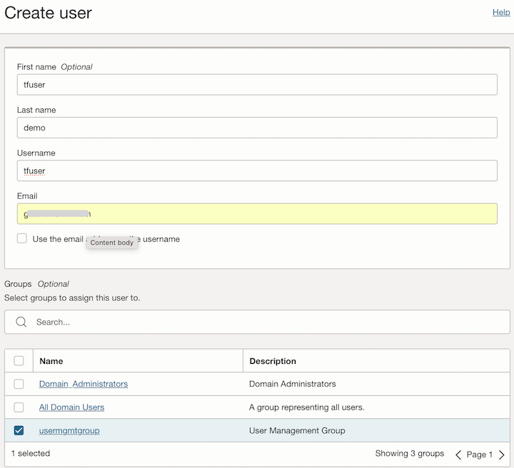
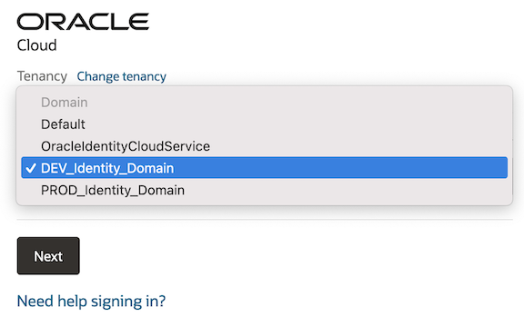
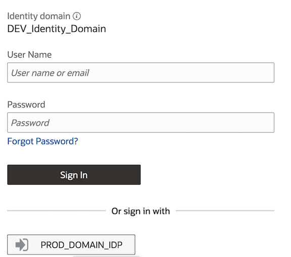
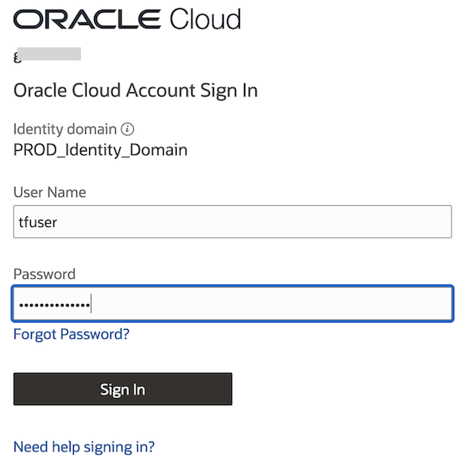

# OCI Identity Domains Module Usage Example - SSO and SCIM Provisioning between two Identity Domains

## Introduction

This example shows how to configure two OCI Identity Domains as one Identity Provider(IDP) and one Service Provider (SP) with user synchronization based on group membership.  All resources are created in Oracle Cloud Infrastructure (OCI) using the [Identity Domains module](../../README.md).  For a similar setup, please review: [Managing Users Between Multiple IAM Identity Domains Using SAML and SCIM](https://www.ateam-oracle.com/post/managing-users-between-multiple-idcs-using-saml-and-scim)

It creates the following resources in one preexisting compartment:

- **Identity Domains: "PROD-DOMAIN and DEV-DOMAIN"**, in the same preexisting compartment as IDP and SP respectively.  
- **SAML Application: "SAML_APP"**, SAML application in PROD-DOMAIN that allows users to use single sign-on (SSO) between DEV-DOMAIN and PROD-DOMAIN.
- **Catalog Application Oracle Identity Domain: "SCIM_APP"**, SCIM application in PROD-DOMAIN for provisioning to DEV-DOMAIN.
- **Confidential Application: "CONF_APP"**, Confidential Application with client credentials in DEV-DOMAIN to provide access for provisioning.
- **Identity Provider: "IDP"**, identity provider in DEV-DOMAIN using SAML metadata automatically obtained from PROD-DOMAIN.
- **Groups:  "PROD_GROUP"**.  in PROD-DOMAIN and granted to SAM_APP and SCIM_APP to allow members for SSO and provisioning.

## Using this example

1. Please read [Issue #2](../../README.md) for limitations and requirements before executing this example.

2. Rename *input.auto.tfvars.template* to *\<project-name\>.auto.tfvars*, where *\<project-name\>* is any name of your choice.

3. Within *\<project-name\>.auto.tfvars*, provide tenancy connectivity information and adjust the *identity_domains_configuration* input variable, by making the appropriate substitutions:

   - Replace *\<REPLACE-BY-COMPARTMENT-OCID>* placeholder by the identity domain OCID.

    **NOTE**: Each object in the input maps is indexed by an uppercase string, like *APP1*. These strings are used by Terraform as keys to the actual managed resources. They can actually be any random strings, but once defined they **must not be changed**, or Terraform will try to destroy and recreate the applications.

4. In this folder, run the typical Terraform workflow:

   ```
   terraform init
   terraform plan -out plan.out
   terraform apply plan.out
   ```
5. After deployment, using the OCI Console look for both Identity Domains PROD_Identity_Domain and DEV_Identity_Domain in the specified compartment.  Create a user in PROD_Identity_Domain and assign it to the group *usermgmtgroup* (created by Terraform).  

   


   Verify that the new user is provisioned to the Identitiy Domain DEV_Identity_Domain.  Activate the new user using activation email.  Logout and login again, but this time select the Identity Domain DEV_Identity_Domain.

   


   click on the IDP button  *PROD_DOMAIN_IDP* the in the login screen.

   

   Login as the new user.

     

   The new user should be logged in as a user in DEV_DOMAIN:  e.g.  DEV_Identity_Domain/tfuser