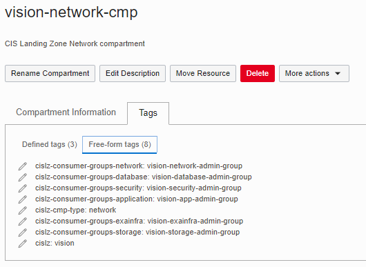

# CIS OCI Landing Zone IAM Policy Module


 This module manages Oracle Cloud Infrastructure (OCI) Identity and Access Management (IAM) policies, providing a Role Based Access Control (RBAC) framework that implements Separation of Duties (SoD) through template policies. Within this implementation, the Least Privilege security principle is enforced, as recommended by CIS (Center for Internet Security) OCI Foundations Benchmark.

 The module operates over a single *policies_configuration* input variable.

 Check [module specification](./SPEC.md) for a full description of module requirements, supported variables, managed resources and outputs.

 Check the [examples](./examples/) folder for actual module usage. 

- [Requirements](#requirements)
- [How to Invoke the Module](#invoke)
- [Module Functioning](#functioning)
- [Related Documentation](#related)
- [Known Issues](#issues)

## <a name="requirements">Requirements</a>
### IAM Permissions

This module requires the following OCI IAM permissions in the top-most compartment that policies get attached to.
```
Allow group <group> to manage policies in compartment <compartment_name>
```
If the top-most compartment is the root compartment, the permission becomes:
```
Allow group <group> to manage policies in tenancy
```
Additionally, it needs to read compartments in the tenancy:
```
Allow group <group> to read compartments in tenancy
```

### Terraform Version < 1.3.x and Optional Object Type Attributes
This module relies on [Terraform Optional Object Type Attributes feature](https://developer.hashicorp.com/terraform/language/expressions/type-constraints#optional-object-type-attributes), which is experimental from Terraform 0.14.x to 1.2.x. It shortens the amount of input values in complex object types, by having Terraform automatically inserting a default value for any missing optional attributes. The feature has been promoted and it is no longer experimental in Terraform 1.3.x.

**As is, this module can only be used with Terraform versions up to 1.2.x**, because it can be consumed by other modules via [OCI Resource Manager service](https://docs.oracle.com/en-us/iaas/Content/ResourceManager/home.htm), that still does not support Terraform 1.3.x.

Upon running *terraform plan* with Terraform versions prior to 1.3.x, Terraform displays the following warning:
```
Warning: Experimental feature "module_variable_optional_attrs" is active
```

Note the warning is harmless. The code has been tested with Terraform 1.3.x and the implementation is fully compatible.

If you really want to use Terraform 1.3.x, in [providers.tf](./providers.tf):
1. Change the terraform version requirement to:
```
required_version = ">= 1.3.0"
```
2. Remove the line:
```
experiments = [module_variable_optional_attrs]
```
## <a name="invoke">How to Invoke the Module</a>

Terraform modules can be invoked locally or remotely. 

For invoking the module locally, just set the module *source* attribute to the module file path (relative path works). The following example assumes the module is two folders up in the file system.
```
module "policies" {
  source = "../.."
  tenancy_ocid = var.tenancy_ocid
  policies_configuration = var.policies_configuration

}
```

For invoking the module remotely, set the module *source* attribute to the policies module folder in this repository, as shown:
```
module "policies" {
  source = "git@github.com:oracle-quickstart/terraform-oci-cis-landing-zone-iam-modules.git//policies"
  tenancy_ocid = var.tenancy_ocid
  policies_configuration = var.policies_configuration
}
```
For referring to a specific module version, append *ref=\<version\>* to the *source* attribute value, as in:
```
  source = "git@github.com:oracle-quickstart/terraform-oci-cis-landing-zone-iam-modules.git//policies?ref=v0.1.0"
```
## <a name="functioning">Module Functioning</a>

 The module operates in two non-exclusive modes: 
 - **Template policies**: At the compartment level (excluding the *root* compartment), policies are driven off freeform tags applied to compartments. At the tenancy level (*root* compartment), policies are driven off supplied roles assigned to groups that must be passed to the module.
 - **Supplied policies**: a map of policies is supplied to the module.

 Regardless the mode, the module checks policy statements against CIS OCI Foundations Benchmark recommendations. For example, the module would not allow a statement like *allow group to manage all-resources in tenancy*.

 ### 1) Template Policies

 In this mode, policies are pre-configured, providing an RBAC implementation across a set of pre-defined group roles. 
 
 At the compartment level, freeform tags applied to compartments drive the creation of policies. These tags define the set of target compartments, the compartments types and consumer groups. 
 
 Target compartments to which policies are applied can be provided in two ways: 
 
 - internal data source: the module select compartments that have the *cislz* freeform tag value matching *cislz_tag_lookup_value* input attribute.
 - *supplied_compartments* attribute: a list of compartments with *name*, *ocid* and *freeform_tags* attributes set.
  
 - *supplied_compartments* takes precedence over the data source. If *supplied_compartments* is not set, the data source is used.
 - As a rule of thumb, use the data source when using the module in stand alone mode. Use *supplied_compartments* when this module is part of the same Terraform configuration that manages compartments. 
 
 At the tenancy level, policies are created based on groups roles passed to the module via *groups_with_tenancy_level_roles* attribute.

 #### 1.1) Compartment Level Policies

The module looks up for the following **freeform tags** applied to **compartments**. Check [Compartments Module examples](../compartments/examples) for how these tags are applied.

- cislz
- cislz-cmp-type
- cislz-consumer-groups-read
- cislz-consumer-groups-iam
- cislz-consumer-groups-security
- cislz-consumer-groups-network
- cislz-consumer-groups-application
- cislz-consumer-groups-database
- cislz-consumer-groups-exainfra
- cislz-consumer-groups-storage
- cislz-consumer-groups-dyn-database-kms
- cislz-consumer-groups-dyn-compute-agent

##### Tag cislz

Defines the set of target compartments for policy generation. Compartments tagged with *cislz* freeform tag are selected if the tag value matches the lookup value passed in *cislz_tag_lookup_value* attribute. No policies are created if *cislz* tag and *cislz_tag_lookup_value* do not match. Ignored if *supplied_compartments* attribute is set.

##### Tag cislz-cmp-type

Defines the compartment's intent, in other words, it communicates the OCI resource types the compartment is intended to hold. For instance, a compartment can be created with the objective of holding network resources, or security resources, or both. 

Currently supported values:

- **security**: compartment´s intent to hold *security* related resources, hence this value drives the creation of *security* related policies.
- **network**: compartment´s intent to hold *network* related resources, hence this value drives the creation of *network* related policies.
- **application**: compartment´s intent to hold *application* related resources, hence this value drives the creation of *application* related policies.
- **database**: compartment´s intent to hold *database* related resources, hence this value drives the creation of *database* related policies.
- **exainfra**: compartment´s intent to hold *Exatada Cloud Service Infrastructure* related resources, hence this value drives the creation of *Exatada Cloud Service infrastructure* policies.
- **enclosing**: drives the creation of policies that are scoped to more than one compartment, as a compartment tagged as *enclosing* is intended to be the parent of above compartment types.

Multiple values can be assigned to *cislz-cmp-type*, as a comma separated list. No policies are created if there is no tag assignment or an invalid value is provided.

##### cislz-consumer-groups-\<suffix\> Tags

The *cislz-consumer-groups-\<suffix\>* tags define the groups that use (or consume) resources from the compartment, denoting the groups' interest in the resources. For instance, a tag *cislz-consumer-groups-database: database-admin-group* indicates *database-admin-group* consumes resources in the compartment from a *database* admin perspective. This results in policy statements granting specific *database* related permissions to the group in the compartment.

The *cislz-consumer-groups-\<suffix\>* tags supports a comma-separated string of values, which allows for communicating the interest of multiple groups in a single compartment. This is important in scenarios where a compartment provides shared services, must be managed by different administrators and is used (consumed) by roles with other responsibilities. 

Picture the use case where a single compartment provide network and security services. It might be the case it requires distinct administrators for network and security resources. Moreover, distinct database administrators (Dev admin and Prod admin) may need access to those resources. In this scenario, the compartment would be tagged like:
```
cislz-cmp-type: network, security
cislz-consumer-groups-network: network-admin
cislz-consumer-groups-security: security-admin
cislz-consumer-groups-database: dev-database-admin, prod-database-admin
```

Currently supported tag names:

- **cislz-consumer-groups-read**: defines the groups that can only read from the compartment. 
- **cislz-consumer-groups-iam**: defines the groups that manage or consume compartment resources from an *IAM* admin perspective. 
- **cislz-consumer-groups-security**: defines the groups that manage or consume compartment resources from a *security* admin perspective.
- **cislz-consumer-groups-network**: defines the groups that manage or consume compartment resources from a *network* admin perspective.
- **cislz-consumer-groups-application**: defines the groups that manage or consume compartment resources from an *application* admin perspective.
- **cislz-consumer-groups-database**: defines the groups that manage or consume compartment resources from a *database* admin perspective.
- **cislz-consumer-groups-exainfra**: defines the groups that manage or consume compartment resources from an *Exadata Cloud Service infrastructure* admin perspective.
- **cislz-consumer-groups-storage**: defines the groups that manage or consume compartment resources from a *storage* admin perspective.
- **cislz-consumer-groups-dyn-database-kms**: defines the dynamic groups that consume key management services (KMS) from the perspective of a database system. This typically applies to compartments tagged with *cislz-cmp-type:security*, as security compartments are an adequate container for KMS.
- **cislz-consumer-groups-dyn-compute-agent**: defines the dynamic groups allowed to execute Compute agent plugin in the compartment.

##### Policy Generation Logic

The actual applied policies are the combined result of *cislz-cmp-type* and *cislz-consumer-groups-\<suffix\>* values. *cislz-cmp-type* defines the greater set of OCI resource types available for the compartment, while *cislz-consumer-groups-\<suffix\>* defines the grantees and their access levels (*manage,use,read,inspect*) on a subset of those resource types. Whenever *cislz-cmp-type* matches *\<suffix\>*, manage permissions in compartment resources are granted to *cislz-consumer-groups-\<suffix\>*.

**IMPORTANT**: There is an implied relationship between *cislz-cmp-type* and *\<suffix\>* in *cislz-consumer-groups-\<suffix\>* as far as *manage* permissions are concerned, according to table below:

**cislz-cmp-type** | **cislz-consumer-groups' \<suffix\>** | **Policy Outcome**
--------------|-------------|----------
*security* | *security* | *manage* permissions are granted over *security* related resources to groups names assigned to *cislz-consumer-groups-security*.
*network* | *network* | *manage* permissions are granted over *network* related resources to groups names assigned to *cislz-consumer-groups-network*.
*application* | *application* | *manage* permissions are granted over *application* related resources to groups names assigned to *cislz-consumer-groups-application*.
*database* | *database* | *manage* permissions are granted over *database* related resources to groups names assigned to *cislz-consumer-groups-database*.
*exainfra* | *exainfra* | *manage* permissions are granted over *Exadata Cloud Service Infrastructure* related resources to groups names assigned to *cislz-consumer-groups-exainfra*.

##### Policy Naming

At the compartments level, policies are generated for each selected compartment. As such they are named after compartment names, following the pattern *policy_name_prefix*\<compartment_name\>*policy_name_suffix*.
You can tweak policy names by changing *policy_name_prefix* and *policy_name_suffix* atributes. Default values are: 
- *policy_name_prefix* : ""
- *policy_name_suffix* : "-policy"

##### Policy Attachment

The compartment scope in policy statements defines the compartment to which the policy is attached. For instance, statements ending with *in compartment security* are always attached to the *security* compartment; statements ending with *in compartment network* are always attached to the *network* compartment, and so on.

##### Putting it Together - A Real Example

As an example, assume the following tags are assigned to the *vision-network-cmp* compartment:



- *cislz: vision*: the value is matched against provided *cislz_tag_lookup_value* attribute for retrieving the compartment.
- *cislz-cmp-type: network*: the value communicates this compartment is about *network* resource types, hence network policy statements should be pulled from the template.
- *cislz-consumer-groups-network: vision-network-admin-group*: the value communicates the group name that effectively manages compartment resources, because the tag name *\<suffix\>* matches *cislz-cmp-type* value, per table above.
- *cislz-consumer-groups-security: vision-security-admin-group*: the value communicates the group name that consumes compartment resources from a *security* admin perspective.  
- *cislz-consumer-groups-application: vision-app-admin-group*: the value communicates the group name that consumes compartment resources from an *application* admin perspective.
- *cislz-consumer-groups-database: vision-database-admin-group*: the value communicates the group name that consumes compartment resources from a *database* admin perspective.
- *cislz-consumer-groups-storage: vision-storage-admin-group*: the value communicates the group name that consumes compartment resources from a *storage* admin perspective.
- *cislz-consumer-groups-exainfra: vision-exainfra-admin-group*: the value communicates the group name that consumes compartment resources from an *exainfra* (Exadata Cloud Service Infrastructure) admin perspective.

Per applied tags the module attaches the following policy to *vision-network-cmp* compartment:

```
allow group vision-network-admin-group to read all-resources in compartment vision-network-cmp
allow group vision-network-admin-group to manage virtual-network-family in compartment vision-network-cmp
allow group vision-network-admin-group to manage dns in compartment vision-network-cmp
allow group vision-network-admin-group to manage load-balancers in compartment vision-network-cmp
allow group vision-network-admin-group to manage alarms in compartment vision-network-cmp
allow group vision-network-admin-group to manage metrics in compartment vision-network-cmp
allow group vision-network-admin-group to manage ons-family in compartment vision-network-cmp
allow group vision-network-admin-group to manage orm-stacks in compartment vision-network-cmp
allow group vision-network-admin-group to manage orm-jobs in compartment vision-network-cmp
allow group vision-network-admin-group to manage orm-config-source-providers in compartment vision-network-cmp
allow group vision-network-admin-group to read audit-events in compartment vision-network-cmp
allow group vision-network-admin-group to read work-requests in compartment vision-network-cmp
allow group vision-network-admin-group to manage instance-family in compartment vision-network-cmp
allow group vision-network-admin-group to manage volume-family in compartment vision-network-cmp where all{request.permission != 'VOLUME_BACKUP_DELETE', request.permission != 'VOLUME_DELETE', request.permission != 'BOOT_VOLUME_BACKUP_DELETE'}
allow group vision-network-admin-group to manage object-family in compartment vision-network-cmp where all{request.permission != 'OBJECT_DELETE', request.permission != 'BUCKET_DELETE'}
allow group vision-network-admin-group to manage file-family in compartment vision-network-cmp where all{request.permission != 'FILE_SYSTEM_DELETE', request.permission != 'MOUNT_TARGET_DELETE', request.permission != 'EXPORT_SET_DELETE', request.permission != 'FILE_SYSTEM_DELETE_SNAPSHOT', request.permission != 'FILE_SYSTEM_NFSv3_UNEXPORT'}
allow group vision-network-admin-group to manage bastion-session in compartment vision-network-cmp
allow group vision-network-admin-group to manage cloudevents-rules in compartment vision-network-cmp
allow group vision-network-admin-group to manage alarms in compartment vision-network-cmp
allow group vision-network-admin-group to manage metrics in compartment vision-network-cmp
allow group vision-network-admin-group to read instance-agent-plugins in compartment vision-network-cmp
allow group vision-security-admin-group to read virtual-network-family in compartment vision-network-cmp
allow group vision-security-admin-group to use subnets in compartment vision-network-cmp
allow group vision-security-admin-group to use network-security-groups in compartment vision-network-cmp
allow group vision-security-admin-group to use vnics in compartment vision-network-cmp
allow group vision-app-admin-group to read virtual-network-family in compartment vision-network-cmp
allow group vision-app-admin-group to use subnets in compartment vision-network-cmp
allow group vision-app-admin-group to use network-security-groups in compartment vision-network-cmp
allow group vision-app-admin-group to use vnics in compartment vision-network-cmp
allow group vision-app-admin-group to use load-balancers in compartment vision-network-cmp
allow group vision-database-admin-group to read virtual-network-family in compartment vision-network-cmp
allow group vision-database-admin-group to use vnics in compartment vision-network-cmp
allow group vision-database-admin-group to use subnets in compartment vision-network-cmp
allow group vision-database-admin-group to use network-security-groups in compartment vision-network-cmp
allow group vision-exainfra-admin-group to read virtual-network-family in compartment vision-network-cmp
allow group vision-storage-admin-group to read bucket in compartment vision-network-cmp
allow group vision-storage-admin-group to inspect object in compartment vision-network-cmp
allow group vision-storage-admin-group to manage object-family in compartment vision-network-cmp where any {request.permission = 'OBJECT_DELETE', request.permission = 'BUCKET_DELETE'}
allow group vision-storage-admin-group to read volume-family in compartment vision-network-cmp
allow group vision-storage-admin-group to manage volume-family in compartment vision-network-cmp where any {request.permission = 'VOLUME_DELETE', request.permission = 'VOLUME_BACKUP_DELETE', request.permission = 'BOOT_VOLUME_BACKUP_DELETE'}
allow group vision-storage-admin-group to read file-family in compartment vision-network-cmp
allow group vision-storage-admin-group to manage file-family in compartment vision-network-cmp where any {request.permission = 'FILE_SYSTEM_DELETE', request.permission = 'MOUNT_TARGET_DELETE', request.permission = 'VNIC_DELETE', request.permission = 'SUBNET_DETACH', request.permission = 'VNIC_DETACH', request.permission = 'PRIVATE_IP_DELETE', request.permission = 'PRIVATE_IP_UNASSIGN', request.permission = 'VNIC_UNASSIGN', request.permission = 'EXPORT_SET_UPDATE', request.permission = 'FILE_SYSTEM_NFSv3_UNEXPORT', request.permission = 'EXPORT_SET_DELETE', request.permission = 'FILE_SYSTEM_DELETE_SNAPSHOT'}
```

#### 1.2) Tenancy Level Policies

Tenancy level policies are not based off compartment tags because they are applied at the root compartment level. Per design we decided not to tag the root compartment for policy configuration. Instead, tenancy level policies are configured per group roles passed into the module as input through *groups_with_tenancy_level_roles* attribute.

Supported tenancy level roles:

- **iam**: grants IAM related admin permissions at the tenancy level.
- **cost**: grants cost related admin permissions at the tenancy level.
- **cred**: grants credential related admin permissions at the tenancy level.
- **security**: grants security related admin permissions at the tenancy level.
- **application**: grants (read-only) application related permissions at the tenancy level.
- **auditor**: grants (read-only) auditing permissions at the tenancy level.
- **announcement-reader**: grants announcement reading permissions at the tenancy level.
- **basic**: grants simple basic permissions at the tenancy level, specifically the ability to use cloud-shell and read usage-budgets.

As OCI supports 50 statements per policy, tenancy level grants are split into two policies: one for all groups with manage/use permissions over at least one resource and one for groups with only read/inspect and basic role permissions.

##### Policy Naming

At the tenancy level, two policies are generated, named as:
- *policy_name_prefix*root-admin*policy_name_suffix*: for all groups with manage/use permissions over at least one resource
- *policy_name_prefix*root-non-admin*policy_name_suffix*: for groups with only read/inspect and basic role permissions.

You can tweak policy names by changing *policy_name_prefix* and *policy_name_suffix* atributes. Default values are: 
- *policy_name_prefix* : ""
- *policy_name_suffix* : "-policy"

##### Policy Attachment

Tenancy level policies are always attached at the root compartment.

##### Putting it Together - A Concrete Example

As an example, let's assume the following *groups_with_tenancy_level_roles* attribute is passed to the module:

```
groups_with_tenancy_level_roles = [
    {"name":"vision-iam-admin-group",     "roles":"iam"},
    {"name":"vision-cred-admin-group",    "roles":"cred"},
    {"name":"vision-cost-admin-group",    "roles":"cost"},
    {"name":"vision-security-admin-group","roles":"security"},
    {"name":"vision-app-admin-group",     "roles":"application"},
    {"name":"vision-auditor-group",       "roles":"auditor"},
    {"name":"vision-announcement_reader-group","roles":"announcement-reader"},
    {"name":"vision-database-admin-group","roles":"basic"},
    {"name":"vision-exainfra-admin-group","roles":"basic"},
    {"name":"vision-storage-admin-group", "roles":"basic"}
  ]
```
The following two policies would be attached to the root compartment.

Policy with *manage* or *use* permissions:

```
define tenancy usage-report as ocid1.tenancy.oc1..aaaaaaaaned4fkpkisbwjlr56u7cj63lf3wffbilvqknstgtvzub7vhqkggq
allow group vision-cost-admin-group to manage usage-report in tenancy
allow group vision-cost-admin-group to manage usage-budgets in tenancy
endorse group vision-cost-admin-group to read objects in tenancy usage-report
allow group vision-iam-admin-group to inspect users in tenancy
allow group vision-iam-admin-group to inspect groups in tenancy
allow group vision-iam-admin-group to read policies in tenancy
allow group vision-iam-admin-group to manage groups in tenancy where all {target.group.name != 'Administrators', target.group.name != 'vision-cred-admin-group'}
allow group vision-iam-admin-group to inspect identity-providers in tenancy
allow group vision-iam-admin-group to manage identity-providers in tenancy where any {request.operation = 'AddIdpGroupMapping', request.operation = 'DeleteIdpGroupMapping'}
allow group vision-iam-admin-group to manage dynamic-groups in tenancy
allow group vision-iam-admin-group to manage authentication-policies in tenancy
allow group vision-iam-admin-group to manage network-sources in tenancy
allow group vision-iam-admin-group to manage quota in tenancy
allow group vision-iam-admin-group to read audit-events in tenancy
allow group vision-iam-admin-group to manage tag-defaults in tenancy
allow group vision-iam-admin-group to manage tag-namespaces in tenancy
allow group vision-iam-admin-group to manage orm-stacks in tenancy
allow group vision-iam-admin-group to manage orm-jobs in tenancy
allow group vision-iam-admin-group to manage orm-config-source-providers in tenancy
allow group vision-cred-admin-group to inspect users in tenancy
allow group vision-cred-admin-group to inspect groups in tenancy
allow group vision-cred-admin-group to manage users in tenancy  where any {request.operation = 'ListApiKeys',request.operation = 'ListAuthTokens',request.operation = 'ListCustomerSecretKeys',request.operation = 'UploadApiKey',request.operation = 'DeleteApiKey',request.operation = 'UpdateAuthToken',request.operation = 'CreateAuthToken',request.operation = 'DeleteAuthToken',request.operation = 'CreateSecretKey',request.operation = 'UpdateCustomerSecretKey',request.operation = 'DeleteCustomerSecretKey',request.operation = 'UpdateUserCapabilities'}
allow group vision-security-admin-group to manage cloudevents-rules in tenancy
allow group vision-security-admin-group to manage cloud-guard-family in tenancy
allow group vision-security-admin-group to read tenancies in tenancy
allow group vision-security-admin-group to read objectstorage-namespaces in tenancy
```

Policy with *read*, *inspect*, and *basic* role permissions:

```
allow group vision-announcement_reader-group,vision-app-admin-group,vision-auditor-group,vision-cost-admin-group,vision-cred-admin-group,vision-database-admin-group,vision-exainfra-admin-group,vision-iam-admin-group,vision-security-admin-group,vision-storage-admin-group to use cloud-shell in tenancy
allow group vision-announcement_reader-group,vision-app-admin-group,vision-auditor-group,vision-cost-admin-group,vision-cred-admin-group,vision-database-admin-group,vision-exainfra-admin-group,vision-iam-admin-group,vision-security-admin-group,vision-storage-admin-group to read usage-budgets in tenancy
allow group vision-auditor-group to inspect all-resources in tenancy
allow group vision-auditor-group to read instances in tenancy
allow group vision-auditor-group to read load-balancers in tenancy
allow group vision-auditor-group to read buckets in tenancy
allow group vision-auditor-group to read nat-gateways in tenancy
allow group vision-auditor-group to read public-ips in tenancy
allow group vision-auditor-group to read file-family in tenancy
allow group vision-auditor-group to read instance-configurations in tenancy
allow group vision-auditor-group to read network-security-groups in tenancy
allow group vision-auditor-group to read resource-availability in tenancy
allow group vision-auditor-group to read audit-events in tenancy
allow group vision-auditor-group to read users in tenancy
allow group vision-auditor-group to read vss-family in tenancy
allow group vision-auditor-group to read data-safe-family in tenancy
allow group vision-announcement_reader-group to read announcements in tenancy
```

### 2) Supplied Policies

In this mode, policies are provided as an input parameter and can supplement or completely override the template policies.

For completely overriding the template policies, set attributes *enable_compartment_level_template_policies* and *enable_tenancy_level_template_policies* to false.

Supplied policies are defined using the *supplied_policies* attribute.

Check the [Vision example](./examples/vision) for how to supply your own policies.

## <a name="related">Related Documentation</a>
- [Getting Started with OCI Policies](https://docs.oracle.com/en-us/iaas/Content/Identity/Concepts/policygetstarted.htm)
- [How Policies Work](https://docs.oracle.com/en-us/iaas/Content/Identity/Concepts/policies.htm)
- [Advanced Policy Features](https://docs.oracle.com/en-us/iaas/Content/Identity/Concepts/policyadvancedfeatures.htm)
- [Policies in Terraform OCI Provider](https://registry.terraform.io/providers/oracle/oci/4.112.0/docs/resources/identity_policy)

## <a name="issues">Known Issues</a>
None.