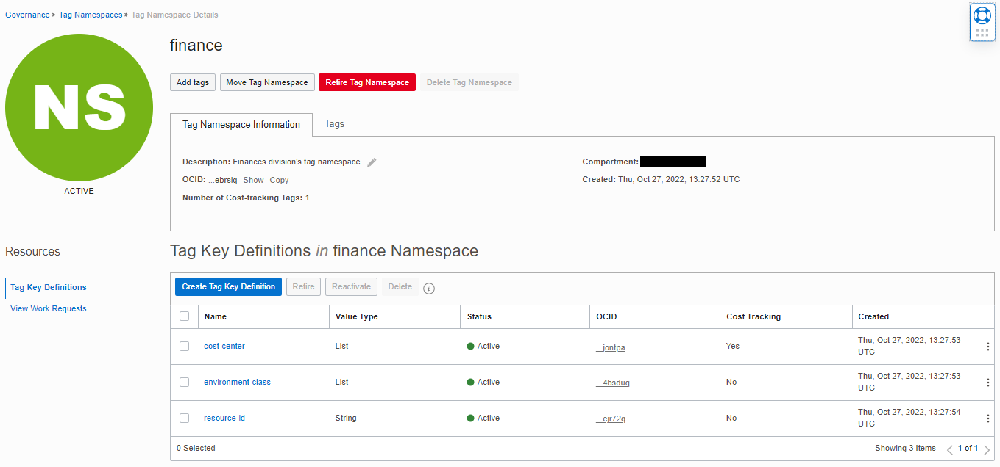
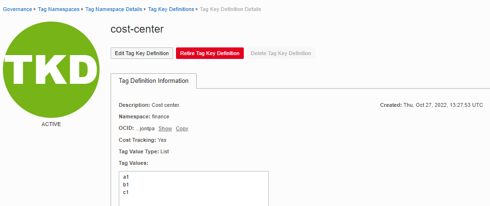
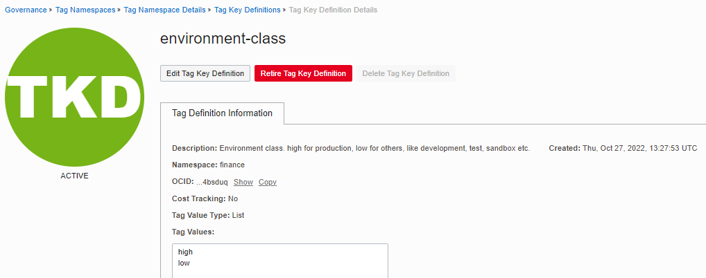
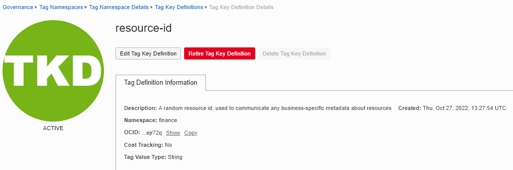

# CIS OCI IAM Tags Module Example - Finance Division Tags

## Introduction

This example shows how to manage defined tags in Oracle Cloud Infrastructure. 

If "Oracle-Tags" namespace is not defined in the tenancy, it manages a tag namespace and tags for identifying resource creators (*CreatedBy*) and the time when resources are created (*CreatedOn*). These tags are recommended by CIS OCI Foundations Benchmark. If for some reason you want to disable them, set *enable_cislz_namespace* variable to false in [main.tf](./main.tf).

The following resources are created in this example:

- One tag namespace: finance.
- Three tags: cost-center, environment-class, resource-id.
- No tag defaults.

Here's how these resources appear in OCI Console:









## Using this example
1. See [input.auto.tfvars.template](./input.auto.tfvars.template) for providing tenancy connectivity information and setting the module input variable. 

2. In this folder, run the typical Terraform workflow:
```
terraform init
terraform plan -out plan.out
terraform apply plan.out
```